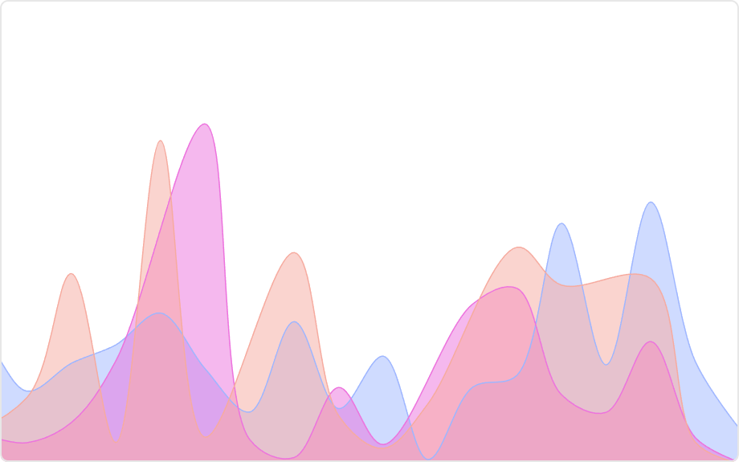

# Area Chart Mod for Spotfire®

Similar to a line chart, except that the area below the lines is filled with colors to represent and compare the evolution of quantitative values over a time period. Values of each category are displayed on top of each other, allowing to understand the evolution of both the total of a numeric variable, and the importance of each category.

## Installation & Use

[Download latest version](https://github.com/spotfiresoftware/spotfire-mod-area/releases)

The [Wiki](https://github.com/spotfiresoftware/spotfire-mod-area/wiki) contains step-by-step instruction on how to install and use this Mod in Spotfire®.

## Building the Project

In a terminal window:
- `npm install`
- `npm run build-watch`

In a new terminal window:
- `npm run server`

### Building for production

The development version of bundle.js is uncompressed and not suitable for end-users. Run the following command to compress the bundle:
- `npm run build`

## About Mods for Spotfire®
-   [Spotfire Community Exchange](https://community.spotfire.com/files/): A safe and trusted place to discover ready-to-use Mods
-   [Developer documentation](https://spotfiresoftware.github.io/spotfire-mods/docs/): Introduction and tutorials for Mods developers
-   [Mods examples](https://github.com/TIBCOSoftware/spotfire-mods/): A public repository for examples projects
